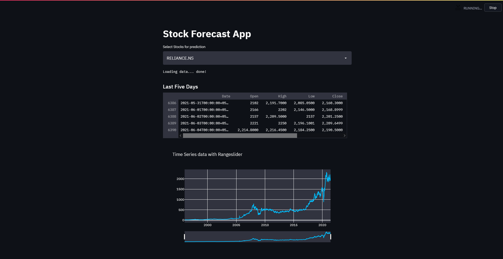
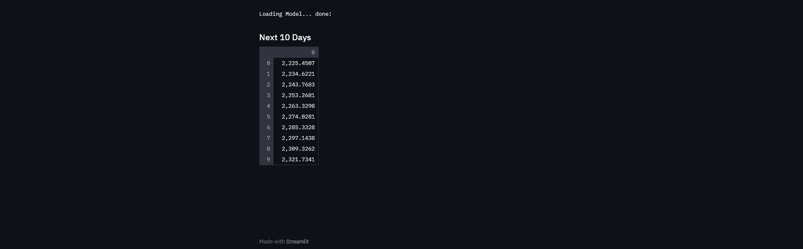

# Stock Market Prediction StreamlitApp
This is a Streamlit application for stock price forecasting using an LSTM model(Long short-term memory).

### Clone the repository:
    git clone https://github.com/BluHunt/Stock-Market-PredictionStreamlit-App.git

### Install the required packages:
    pip install -r requirements.txt
    
### Usage

1. Run the Streamlit app:

        streamlit run app.py

1. Select a stock from the dropdown menu.

2. View the last five days of data and the raw data plot.

3. The app will train an LSTM model and display the model accuracy.

4. It will predict the next 10 days' closing prices for the selected stock.

### Requirements
    Python 3.6+
    TensorFlow
    scikit-learn
    Streamlit
    pandas
    numpy
    yfinance
    plotly

## Web App GUI

# Q & A

### Q: What does this code do?
A: This code is an implementation of a stock forecast application using LSTM (Long Short-Term Memory) neural networks. It allows the user to select a stock or cryptocurrency from a predefined list and predicts its future closing prices for the next 10 days based on historical data.

### Q: What libraries are used in this code?
A: The code uses several libraries, including:
math: for mathematical operations
tensorflow.keras.layers: for defining the layers of the LSTM model
tensorflow.keras.models: for creating the sequential model
sklearn.preprocessing.MinMaxScaler: for scaling the data
streamlit: for creating the user interface
datetime: for working with date objects
pandas: for data manipulation and analysis
numpy: for numerical operations
yfinance: for fetching stock and crypto data from Yahoo Finance
plotly.graph_objects: for creating interactive plots

### Q: How does the code load stock data?
A: The load_data function uses the yf.download method from the yfinance library to fetch historical stock data for the selected stock or cryptocurrency. It then resets the index of the data to ensure it is in the correct format.

### Q: What does the function plot_raw_data do?
A: The plot_raw_data function generates an interactive plot using plotly.graph_objects. It visualizes the closing prices of the selected stock or cryptocurrency over time, with a rangeslider for easy navigation.

### Q: What does the code do to prepare the data for the LSTM model?
A: The code applies the MinMaxScaler from sklearn.preprocessing to scale the closing price data between 0 and 1. It then reshapes the data into the required format for the LSTM model, creating sliding windows of past 60 closing prices as input features and the next closing price as the target variable.

### Q: How is the LSTM model defined and trained?
A: The LSTM model is created using the Sequential class from tensorflow.keras.models. It consists of two LSTM layers with 50 units each, followed by two dense layers. It is compiled with the Adam optimizer and mean squared error loss function. The model is trained on the training data using the fit method, with a batch size of 1 and one epoch.

### Q: How are the next 10 days' closing price predictions made?
A: The code uses the trained model to make predictions for the next 10 days' closing prices. It takes the last 60 closing prices from the scaled test data and predicts the next closing price. The process is repeated for each subsequent day, appending the predicted prices to the test data. The predicted prices are then transformed back to the original scale using the inverse_transform method of the scaler.

### Q: How are the predicted prices displayed?
A: The predicted closing prices for the next 10 days are displayed using the st.write function from streamlit, showing the values as a list.

Please note that the code provided only trains the model for one epoch, which may not be sufficient for accurate predictions. Consider increasing the number of epochs for better results.
